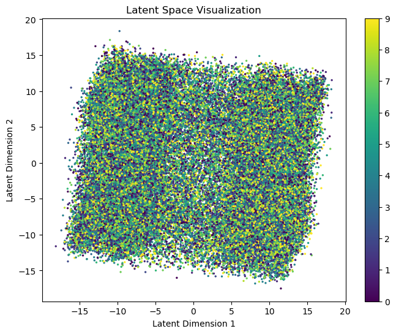
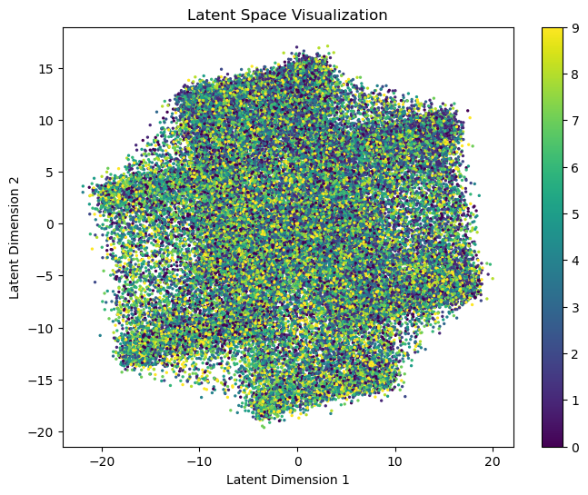
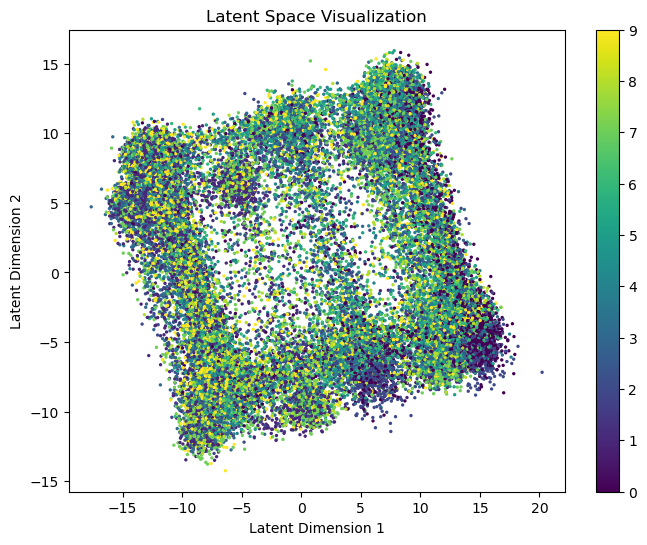
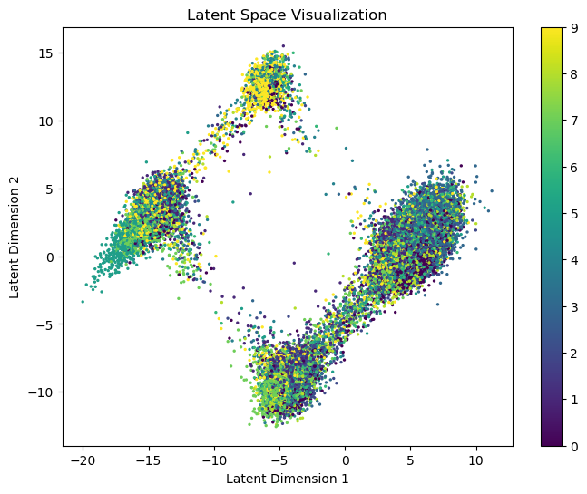

# Project: Enhancing Variational Autoencoder with Normalizing Flows: A Multivariate g-k Distribution and Levenberg-Marquardt Optimization Approach for MNIST Data Generation and Reconstruction

## Overview
This project aims to elevate the performance of a Variational Autoencoder (VAE) by integrating Normalizing Flows with a Multivariate g-k Distribution, optimized using the Levenberg-Marquardt (LM) algorithm. The enhancements are applied to the MNIST dataset to improve the quality and diversity of generated images.

### Key Components

1. **Multivariate g-k Distribution**:
   - The g-k distribution is used as the base distribution within the Normalizing Flows. This distribution is particularly powerful in modeling complex data structures, offering more flexibility than the standard normal distribution.

2. **Levenberg-Marquardt Optimization**:
   - The parameters of the g-k distribution are fine-tuned using the Levenberg-Marquardt algorithm, a robust technique for non-linear parameter estimation. This optimization enhances the flow’s ability to capture intricate patterns in the data, leading to superior performance in generation and reconstruction tasks.

### Implementation Details

- **VAE Architecture**:
  - **Encoder**: Compresses input images from the MNIST dataset into a latent space.
  - **Normalizing Flows**: Applies invertible flows to transform the latent space, leveraging the g-k distribution as the foundational structure.
  - **Decoder**: Reconstructs images from the transformed latent space, aiming for high fidelity and diversity in the output.

- **Training Process**:
  - The model is trained on the MNIST dataset, utilizing the enhanced latent space provided by Normalizing Flows and the g-k distribution. The result is a VAE capable of generating more realistic and complex image data.

### Visual Results

1. **VAE with Combined Flow**  
   
   
2. **VAE-GAN**  
   

3. **Basic Normalizing Flows and Multivariate g-k with LM Optimization**  
   

4. **Introducing Radial Flow with Multivariate g-k and LM Optimization**  
   

### Analysis of the Final Plot (Best Classification Result)

The final plot shows the best classification results:

1. **Clearer Classification**:
   - The data points in this new plot are distinctly grouped into three clusters, indicating that the model effectively separates different categories (likely different digits) in the latent space. This clustered distribution aids in clearer classification of different digits.

2. **Higher Separation in Latent Space**:
   - The noticeable gaps between clusters suggest a higher degree of separation between different categories. This distribution is beneficial for accurately distinguishing and recognizing different categories during the generation process.

3. **Tight Cluster Distribution**:
   - The data points within each cluster are tightly packed, indicating the model’s high consistency in generating samples of the same category, which helps reduce confusion between categories during generation.

4. **Comparison with Previous Plots**:
   - The new plot shows more distinct classification, with clearer clusters and gaps between them. This suggests that the new model may better differentiate between different digits in the generation task.
   - While the new plot has a less extensive coverage of the latent space compared to the previous plots, it offers more explicit and clear classification. Therefore, if the goal is to clearly distinguish between different categories of digits, the new result might be better.

### Summary
- **Sample Quality**: The enhanced VAE model shows significant improvements in generating realistic and diverse images, particularly with Radial Flow combined with the multivariate g-k distribution and LM optimization.
- **Latent Space**: The final plot demonstrates superior category separation and clearer classification, making it the most effective model configuration.

- ## Results

- The enhanced VAE model, utilizing the **Multivariate g-k Distribution** and **Levenberg-Marquardt Optimization**, shows significant improvements in generating realistic and diverse images. These enhancements are clearly demonstrated in the visualizations and quantitative metrics included in the results folder. The combination of the g-k distribution for flexible latent space modeling and the precise parameter optimization via Levenberg-Marquardt has proven highly effective, leading to superior performance in both image generation and reconstruction tasks.

## Contributions
- **Multivariate g-k Distribution Integration**: Introduced a flexible and powerful base distribution in the VAE’s latent space transformation.
- **Levenberg-Marquardt Optimization**: Applied a robust optimization technique to refine the distribution parameters, resulting in better model performance.

